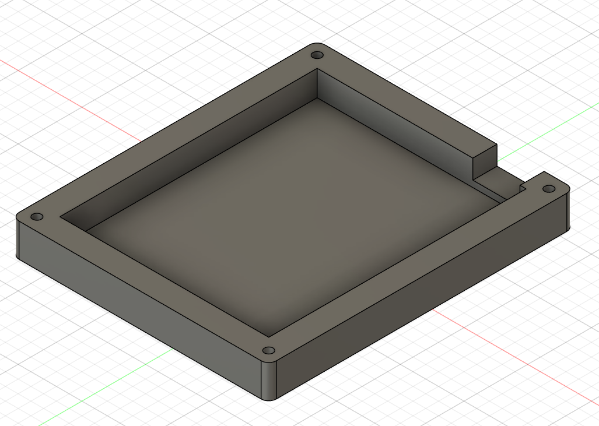

# Sharon's Hackpad
This is a macropad that I made for HackClub's Highway program.

## Features
- 16 Switches (4x4 Matrix)
- 16 Neopixels
- An OLED Screen

## Hackpad

## Schematic

## PCB

## Case

## BOM
- 16x Cherry MX Switches
- 16x DSA Keycaps
- 16x 1N4148 Diodes
- 1x 0.91" 128x32 OLED Display
- 1x XIAO RP2040
- 1x Case Bottom Piece
- 1x Case Top Piece
- 4x M3x16mm Screws
- 4x M3x5mx4mm Heatset Inserts
